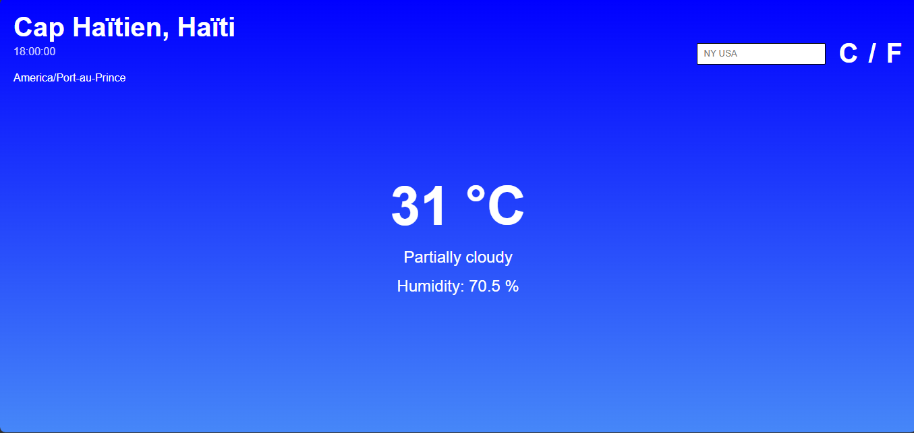

# Odin-Weather-App

A weather application built with **JavaScript, Webpack, and the Visual Crossing Weather API**. Users can search for a city and view current weather conditions, with support for Celsius and Fahrenheit units.

This project was built as part of **The Odin Project** curriculum, with a focus on asynchronous JavaScript, API integration, DOM manipulation, modular code organization, and Webpack.

##  Live Demo


## Preview




##  Features

*  Search weather information by city
*  Switch between Celsius and Fahrenheit
*  Display current humidity
*  Display current weather conditions
*  Display the resolved location returned by the API
*  Display current weather time information
*  Fetch real-time weather data from an external API
*  Responsive user interface
*  Webpack-powered development and production workflow
*  Environment variable configuration for API credentials

## Technologies

### Frontend

* **HTML5** — semantic page structure
* **CSS3** — styling layout
* **JavaScript (ES6+)** — application logic and DOM manipulation

### Tools & APIs

* **Webpack** — module bundling and asset management
* **Visual Crossing Weather API** — weather data
* **dotenv** — environment variable management
* **Git & GitHub** — version control

##  What I Practiced

This project helped me strengthen several core frontend development skills.

### Asynchronous JavaScript

Weather data is retrieved asynchronously using `fetch()` and `async/await`.

```js
const response = await fetch(url);
const data = await response.json();
```

The application also handles unsuccessful requests instead of assuming every API request will succeed.

### API Integration

The application communicates with the Visual Crossing Weather API and dynamically builds requests based on the user's city.

```js
const url = `https://weather.visualcrossing.com/VisualCrossingWebServices/rest/services/timeline/${encodeURIComponent(city)}?key=${API_KEY}&unitGroup=metric`;
```

This introduced practical experience with:

* HTTP requests
* API endpoints
* Query parameters
* JSON responses
* URL encoding
* Error handling

### DOM Manipulation

Weather information returned by the API is dynamically displayed in the interface using JavaScript.

For example:

```js
cityTitle.textContent = currentData.resolvedAddress;
currentTemp.textContent = currentData.currentConditions.temp + " °C";
humidity.textContent =
  "Humidity: " + currentData.currentConditions.humidity + " %";
```

### Webpack

The project uses Webpack to manage JavaScript modules, CSS, and the application build process.

Webpack also allowed me to configure environment variables without hardcoding the API credential directly into the source file.

### Unit Conversion

The application supports both Celsius and Fahrenheit.

```js
const fahrenheit = (celsius * 9 / 5) + 32;
```

This was a practical exercise in transforming API data before presenting it to users.


##  Getting Started

### 1. Clone the repository

```bash
git clone https://github.com/YOUR_USERNAME/YOUR_REPOSITORY.git
```

### 2. Navigate to the project

```bash
cd YOUR_REPOSITORY
```

### 3. Install dependencies

```bash
npm install
```

### 4. Configure the API key

Create a `.env` file in the project root:

```env
API_KEY=your_api_key_here
```

The `.env` file should **not** be committed to Git.

Make sure it is included in `.gitignore`:

```gitignore
.env
node_modules
dist
```

### 5. Start the development server

```bash
npm run start
```

The application should then be available through the local development server.

##  API Key Handling

The project uses environment variables during the Webpack build process rather than placing the API credential directly in the source code.

```js
const API_KEY = process.env.API_KEY;
```

> **Important:** Because this is a frontend application, any API key included in the browser bundle can ultimately be discovered by users. Environment variables help prevent accidentally committing credentials to Git, but they do not make a frontend API key truly secret. A production application requiring a private credential should use a backend or server-side proxy.

## Project Goals

The main goal of this project was not simply to display weather information, but to practice building a small application around a real external API.

Key objectives included:

* Working with asynchronous JavaScript
* Understanding API documentation and responses
* Managing application state
* Dynamically updating the DOM
* Handling user input
* Converting and formatting API data
* Configuring Webpack
* Managing environment variables
* Structuring a project using JavaScript modules
* Using Git throughout the development process

##  Future Improvements

Possible improvements for future iterations include:

* [ ] Add a multi-day weather forecast
* [ ] Add animated weather illustrations based on conditions
* [ ] Improve loading and error states
* [ ] Add weather icons for different conditions
* [ ] Display additional weather metrics such as wind speed and pressure
* [ ] Add geolocation-based weather
* [ ] Improve accessibility
* [ ] Add automated tests
* [ ] Deploy the application with a secure backend API proxy

##  What I Learned

One of the most valuable parts of this project was learning how different frontend concepts work together in a real application.

Instead of working with static data, the interface now responds to **user input, external API responses, asynchronous operations, and different display units**.

This project also reinforced the importance of separating concerns between **data fetching, application logic, and DOM interaction**, while keeping the implementation understandable and maintainable.

##  Author

**Sherdly Verne**


This project is part of my journey toward becoming a professional web developer.
